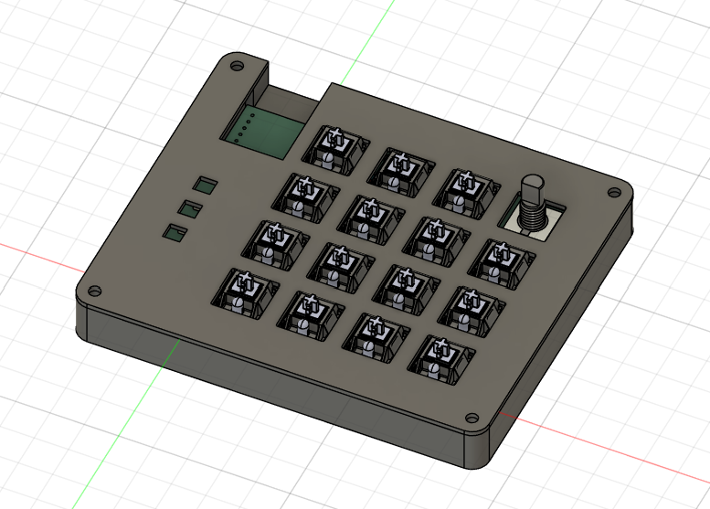
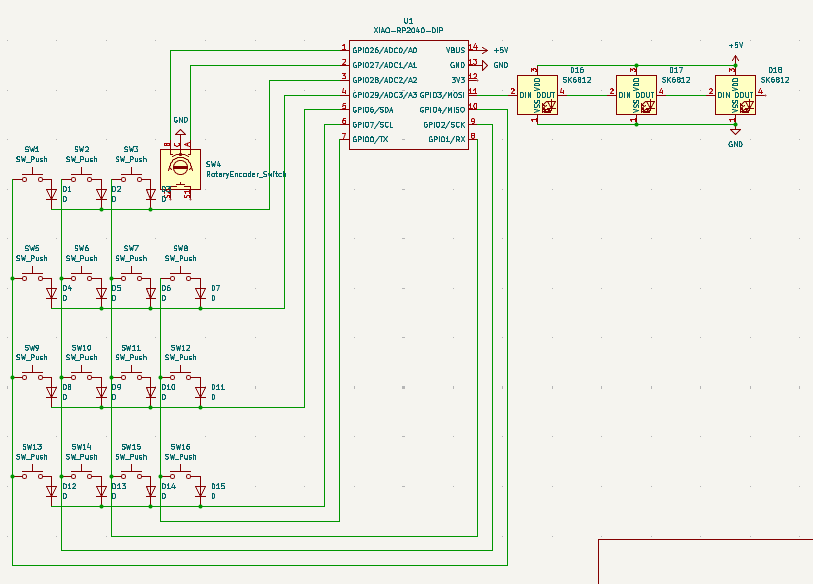
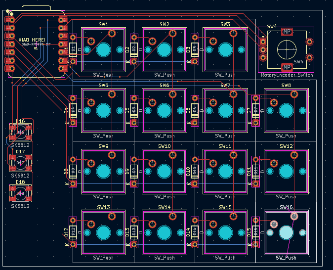
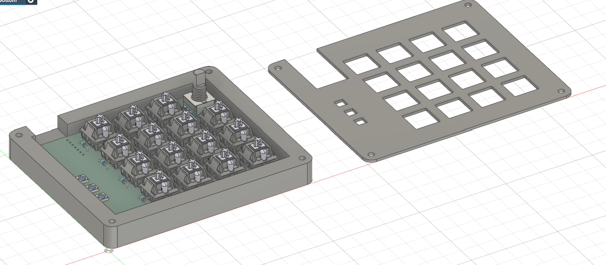

# MacroPad by Antyperspirant36
A compact 15-key mechanical macropad with RGB and a knob.

## The Build

*The complete MacroPad build*

## Features
- 15 mechanical switches
- Alps EC11 rotary encoder
- RGB with SK6812MINI LEDs
- XIAO RP2040
- KMK firmware

## Hardware Details

### Schematic

*The circuit design*

### PCB

*PCB layout*

### Case

*Case design*

## Bill of Materials (BOM)
| Component | Footprint | Quantity | Notes |
|----------|-----------|----------|--------|
| Cherry MX Switches | SW_Cherry_MX_1.00u_PCB | 15x | Any MX-style switch |
| 1N4148 Diodes | D_DO-35_SOD27_P7.62mm_Horizontal | 15x | Through-hole |
| Alps EC11 Encoder | RotaryEncoder_Alps_EC11E-Switch_Vertical_H20mm | 1x | With mounting holes |
| SK6812MINI LEDs | LED_SK6812MINI_PLCC4_3.5x3.5mm_P1.75mm | 3x | RGB |
| XIAO RP2040 | XIAO-RP2040-DIP | 1x | Main controller |
| DSA Keycaps | 1u | 15x | Any MX compatible |
| M3x16mm Screws | - | 4x | Case assembly |
| M3x5mx4mm Heat-set Inserts | - | 4x | Case mounting |

## License
MIT
